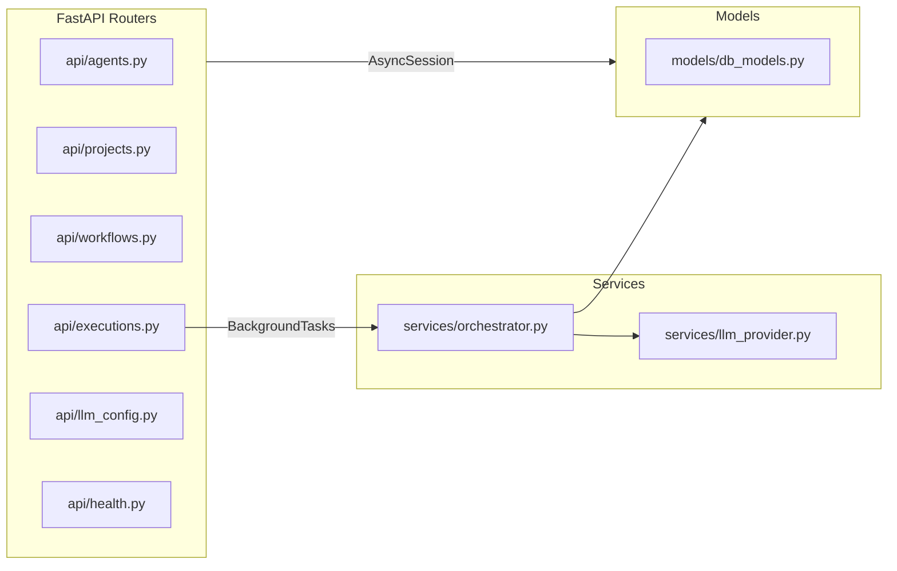
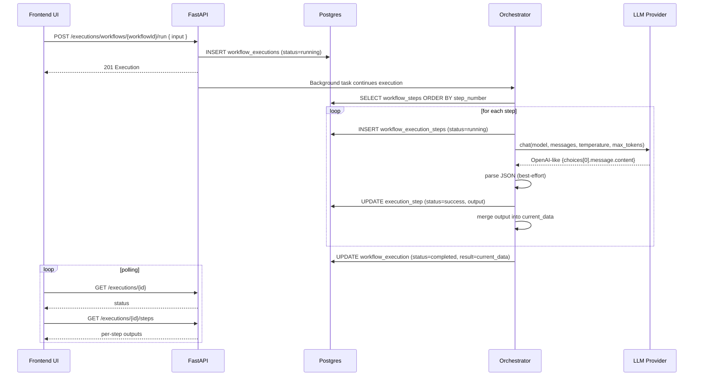

# Project Architecture Blueprint — Content Factory

Generated: 2025-12-14  
Repository: `content-factory` (monorepo)

> This blueprint is derived from the **actual code in this repository** (FastAPI backend + Next.js App Router frontend), not the aspirational specs in `docs/`.
> 
> **Security note:** This repo contains example secrets in `backend/.env.local`. This document intentionally **does not reproduce any secret values**. Treat that file as sensitive.

---

## 1) Architecture Detection and Analysis

### Technology stacks detected

**Backend**
- Python 3.11 (see `backend/Dockerfile`)
- FastAPI (API layer)
- SQLAlchemy async ORM (`sqlalchemy.ext.asyncio`) with asyncpg
- Postgres (Supabase) via `DATABASE_URL`
- httpx for outbound LLM calls

**Frontend**
- Next.js 14 (App Router) + React 18 + TypeScript
- TailwindCSS
- Minimal client-side state via React Context + hooks (no Zustand in the current implementation)
- Tiptap (read-only) for rich Preview rendering
- `marked` markdown parser (with raw HTML disabled)

**Infrastructure / deployment**
- Docker Compose provides two services: backend (uvicorn) and frontend dev container (Node 20 Alpine).

### Architectural pattern detected

This is a **modular monolith** split into two deployable applications:
- **Frontend UI**: Next.js app
- **Backend API**: FastAPI app

Inside the backend, the structure is **layered**:
- API routers (transport layer) →
- Services (orchestrator + LLM provider abstraction) →
- Persistence models (SQLAlchemy ORM) →
- Postgres database

Inside the frontend, the structure is **page-driven (Next App Router)**:
- Pages and client components call a single API client wrapper (`frontend/lib/api.ts`).

---

## 2) Architectural Overview

### What the system does

Content Factory is an “agent workflow studio”:
- Users manage **Projects**, **Agents**, and **Workflows** in the UI.
- A Workflow is a sequence of steps (primarily AGENT steps).
- Running a workflow creates an **Execution**, then the backend **orchestrator** runs steps sequentially, logging inputs/outputs per step.
- The UI polls execution/step endpoints to show live progress and outputs.

### Guiding principles visible in the code

- **DB as source of truth for workflow definitions and execution logs** (agents, workflows, steps, executions, execution_steps).
- **Provider abstraction** for LLM calls (`LLMProvider` + implementations).
- **Deterministic step-by-step execution** with persistence for replayability/debugging.
- **UI clarity**: raw JSON vs a human-friendly Preview derived from JSON → Markdown → HTML rendered in a read-only editor.

### Key boundaries and how they’re enforced

- Frontend never touches DB; it calls backend REST endpoints.
- Orchestrator is the only component that calls the LLM provider.
- DB models are centralized in `backend/models/db_models.py`.

---

## 3) Architecture Visualization (C4-style diagrams)

### 3.1 System Context (Level 1)

```mermaid
flowchart LR
  User[Creator / Operator] -->|Uses| WebUI[Next.js Admin UI]
  WebUI -->|REST JSON| API[FastAPI Backend]
  API -->|SQL (async)| DB[(Postgres / Supabase)]
  API -->|HTTPS| LLM[LLM Providers\n(OpenAI/OpenRouter/Gemini/Mock)]
```

### 3.2 Container Diagram (Level 2)

```mermaid
flowchart TB
  subgraph Browser[User Browser]
    UI[Next.js rendered UI]
  end

  subgraph Frontend[Frontend Container]
    Next[Next.js 14 App Router]
  end

  subgraph Backend[Backend Container]
    FastAPI[FastAPI app\n(backends routes)]
    Orch[Orchestrator\n(sequential runner)]
    LLMProvider[LLM Provider Abstraction]
  end

  subgraph Data[Data Stores]
    PG[(Postgres / Supabase)]
  end

  UI --> Next
  Next -->|fetch()| FastAPI
  FastAPI --> Orch
  Orch --> LLMProvider
  LLMProvider -->|httpx| ExtLLM[External LLM APIs]
  FastAPI -->|SQLAlchemy async| PG
  Orch -->|persist logs| PG
```

### 3.3 Backend Component Diagram (Level 3)



### 3.4 Execution Data Flow (Workflow run)



---

## 4) Core Architectural Components

### Backend

#### 4.1 FastAPI application bootstrap
- Entry: `backend/main.py`
- Config: `.env` + `.env.local` are loaded at startup.
- Routers: `health`, `agents`, `projects`, `workflows`, `executions`, `llm_config`.

#### 4.2 Database layer
- Connection: `backend/db.py`
- Uses `DATABASE_URL` and coerces Postgres driver to `postgresql+asyncpg`.
- Uses an asyncpg “creator” with `statement_cache_size=0` (important for Supabase pooler transaction mode).

**Schema management note**
- There is **no Alembic** in this repo.
- An additive, best-effort startup patch exists for `workflows.wcs` (see `ensure_workflow_wcs_column()` in `backend/db.py`).

#### 4.3 Orchestrator (workflow runtime engine)
- Location: `backend/services/orchestrator.py`
- Responsibilities:
  - Load ordered steps for a workflow.
  - Build per-step `agent_input` using `current_data` and step configuration.
  - Call the LLM provider.
  - Parse/normalize model output into JSON.
  - Persist `WorkflowExecutionStep` logs.
  - Manage pause/resume (manual review / approval).

**WCS (Workflow Configuration Schema)**
- Persisted on `Workflow.wcs` (JSON).
- Can be overridden per run via reserved execution input keys:
  - Preferred: `__workflow_wcs`
  - Legacy: `__workflow_config`
- Injected into each agent call as `agent_input["config"]` keyed by agent_id.

#### 4.4 LLM provider abstraction
- Location: `backend/services/llm_provider.py`
- Interface: `LLMProvider.chat(model, messages, **kwargs)` returning an OpenAI-style response shape.
- Implementations:
  - OpenAIProvider
  - OpenRouterProvider
  - GeminiProvider (adapts messages to Gemini generateContent)
  - MockProvider

#### 4.5 API surface
- Agents: CRUD, plus safe delete guard if used in workflow steps (`backend/api/agents.py`).
- Projects: CRUD (`backend/api/projects.py`).
- Workflows:
  - CRUD (`backend/api/workflows.py`)
  - Steps CRUD under `/workflows/{workflowId}/steps`
  - WCS endpoints:
    - `GET /workflows/{workflowId}/wcs`
    - `PUT /workflows/{workflowId}/wcs`
- Executions (`backend/api/executions.py`):
  - Start run: `POST /executions/workflows/{workflowId}/run` (returns immediately)
  - Polling: `GET /executions/{id}`, `GET /executions/{id}/steps`
  - Approval: `POST /executions/{id}/steps/{stepExecId}/approve|reject`
  - Cancel: `POST /executions/{id}/cancel`

### Frontend

#### 4.6 Next.js App Router structure
- Root layout: `frontend/app/layout.tsx` sets global CSS and wraps with `ProjectProvider`.
- Sidebar navigation: `frontend/components/Sidebar.tsx`.

#### 4.7 Data access layer
- `frontend/lib/api.ts` is a typed wrapper around `fetch()`.
- All pages/components use this wrapper; caching is disabled by default (`cache: "no-store"`).

#### 4.8 Workflow designer + execution viewer
- `frontend/app/workflows/[workflowId]/design/WorkflowDesignClient.tsx`
- Responsibilities:
  - Load steps and agents.
  - Build/merge WCS defaults by parsing agent `prompt_system` INPUT schema (`config`).
  - Persist WCS to DB via `PUT /workflows/{id}/wcs` on Save.
  - Run workflow sending `__workflow_wcs` in execution input.
  - Poll execution progress and show per-step outputs.

#### 4.9 Output Preview pipeline (human-friendly)
- JSON output → Markdown: `frontend/lib/previewFormat.ts`
  - Arrays are always rendered as bullet lists (including arrays of objects) to avoid “meshed up” formatting.
- Markdown → HTML: `marked` in `frontend/components/MarkdownPreview.tsx` (raw HTML disabled).
- HTML → Tiptap read-only editor content.
- Styling: nested list borders and typography in `frontend/styles/globals.css`.

---

## 5) Architectural Layers and Dependency Rules

### Backend (recommended dependency direction)

- `api/*` (transport)
  - depends on `db.get_session` and ORM models
  - may call orchestrator helpers via services
- `services/*` (domain/runtime)
  - depends on ORM models and `LLMProvider`
- `models/*` (persistence)
  - contains SQLAlchemy Base + model definitions

**Avoid**: services importing from API routers.

### Frontend

- `app/**` pages and client components
  - call `lib/api.ts`
  - use small shared components in `components/`

**Avoid**: duplicating endpoint URLs across pages (keep in `lib/api.ts`).

---

## 6) Data Architecture

### Core entities (SQLAlchemy models)
Location: `backend/models/db_models.py`

- `Project`
  - has many `Workflow`
- `Workflow`
  - has many `WorkflowStep`
  - has `wcs` (JSON) persisted per workflow
- `WorkflowStep`
  - fields: `step_number`, `type`, `agent_id`, `requires_approval`, `config`, `next_step_id`
- `Agent`
  - stores prompts, schemas, model configuration
- `WorkflowExecution`
  - references workflow/project
  - stores `input` JSON and `result` JSON
- `WorkflowExecutionStep`
  - references execution and (optional) step_id/agent_id
  - stores per-step `input`, `output`, `error`, timestamps

### WCS (Workflow Configuration Schema) shape

Recommended shape (matches current frontend/backed behavior):

```json
{
  "<agent_id>": {
    "key": "value",
    "flag": true,
    "count": 3
  }
}
```

- Persisted on the workflow record (`workflows.wcs`).
- At runtime, injected into the corresponding agent step input as `config`.

---

## 7) Cross-Cutting Concerns

### Configuration management
- Backend uses environment variables (`DATABASE_URL`, `LLM_PROVIDER`, `GEMINI_API_KEY`, etc.).
- `.env.local` overrides `.env`.
- **Recommendation:** do not commit real keys; prefer secret manager or CI/CD secrets.

### Error handling
- API uses `HTTPException` for not-found/validation errors.
- Orchestrator catches LLM/network errors and stores a readable error message on the execution step.

### Security
- CORS is currently `allow_origins=["*"]` in `backend/main.py` (dev-friendly, not production-safe).

### Observability
- Minimal built-in logging; execution logs are primarily stored in DB via `WorkflowExecutionStep`.

---

## 8) Service Communication Patterns

- Frontend ↔ Backend: synchronous REST/JSON.
- Backend ↔ LLM: synchronous HTTPS via httpx.
- Workflow run continuation: FastAPI `BackgroundTasks` (in-process background execution).
  - **Implication:** if the backend process restarts, in-flight runs may stop.
  - For production-scale reliability, move orchestration to a worker queue (Celery/RQ/Arq) or a separate service.

---

## 9) Technology-Specific Architectural Patterns

### Python / FastAPI
- Async SQLAlchemy sessions injected via `Depends(get_session)`.
- Background work uses `AsyncSessionLocal` to create a new session per background task.

### Next.js
- App Router pages are mostly dynamic and call backend directly via `fetch`.
- Some components are explicitly client components (`"use client"`).

### Tiptap / Preview rendering
- The preview uses a read-only Tiptap editor for consistent typography.
- Inline styles are not relied upon; list styling is handled via CSS selectors due to Tiptap sanitation.

---

## 10) Implementation Patterns (templates)

### Adding a new API resource
1. Create router in `backend/api/<resource>.py` with Pydantic input/output models.
2. Register router in `backend/main.py`.
3. Add typed functions in `frontend/lib/api.ts`.
4. Build UI page under `frontend/app/<resource>/page.tsx`.

### Adding a new LLM provider
1. Implement `LLMProvider` in `backend/services/llm_provider.py`.
2. Extend `get_llm_provider()` factory to recognize `LLM_PROVIDER=<id>`.
3. Optionally add it to `backend/api/llm_config.py` model list.

### Adding a new workflow step type
- Add new `type` value for `WorkflowStep.type` and define behavior in `Orchestrator.run_until_pause_or_end()`.
- Add designer UI affordances in `WorkflowDesignClient.tsx`.

---

## 11) Testing Architecture

- Backend has lightweight scripts like `backend/test_db_connect.py`.
- No dedicated unit/integration test suite is visible for backend or frontend.

**Recommendation:** Add minimal tests around:
- Orchestrator JSON parsing and step progression
- WCS injection logic
- API contract for `/workflows/{id}/wcs`

---

## 12) Deployment Architecture

### Local dev
- Backend: `uvicorn main:app --reload --port 8000`
- Frontend: `next dev --port 3000`

### Docker
- `docker-compose.yml` provides:
  - backend: built from `backend/Dockerfile`
  - frontend: Node container running `npm install` then `npm run dev`

**Production note:** current compose runs frontend in dev mode. For production, build and run `next start`.

---

## 13) Extension and Evolution Patterns

### Where to put new functionality
- Backend:
  - New HTTP endpoints: `backend/api/`
  - New runtime capabilities: `backend/services/`
  - New persistence fields: `backend/models/db_models.py`
- Frontend:
  - New pages: `frontend/app/`
  - Shared UI: `frontend/components/`
  - API wrappers: `frontend/lib/api.ts`

### Backward compatibility strategy in this repo
- Execution reserved keys support both new and legacy names (e.g., `__workflow_wcs` and `__workflow_config`).

---

## 14) Architectural Pattern Examples (from code)

### Example: LLM provider abstraction
See `backend/services/llm_provider.py`:
- `LLMProvider.chat()` defines the stable interface.
- Providers adapt to external APIs but return a unified OpenAI-like response.

### Example: UI API wrapper
See `frontend/lib/api.ts`:
- Single `request<T>()` function centralizes error handling.
- Typed helpers per resource simplify page code.

### Example: Preview rendering pipeline
See `frontend/lib/previewFormat.ts` and `frontend/components/MarkdownPreview.tsx`:
- JSON → markdown bullet lists
- markdown → HTML with raw HTML disabled
- HTML rendered via Tiptap read-only editor

---

## 15) Architectural Decision Records (ADRs)

### ADR-001: Monorepo with split FE/BE
- **Decision:** Keep frontend and backend in one repo for faster iteration.
- **Consequence:** Shared versioning and easier local dev; deployment pipelines may need additional structure later.

### ADR-002: Sequential orchestrator with persisted execution steps
- **Decision:** Persist per-step logs in DB for UI visibility and auditing.
- **Consequence:** Great debuggability; orchestrator logic must stay stable and backwards compatible.

### ADR-003: Pluggable LLM provider with unified response shape
- **Decision:** Normalize responses into OpenAI-like `{choices:[{message:{content}}]}`.
- **Consequence:** Orchestrator stays provider-agnostic; each provider bears adaptation complexity.

### ADR-004: BackgroundTasks for running executions
- **Decision:** Run workflow steps in-process in a background task.
- **Consequence:** Simple deployment; less reliable for long runs/scale (process restarts interrupt runs).

### ADR-005: Persist Workflow Configuration Schema (WCS) on workflow
- **Decision:** Store WCS in `workflows.wcs` and allow per-run override.
- **Consequence:** Config edits survive refresh and are reproducible; schema evolution needs care.

---

## 16) Architecture Governance

- Product/engineering specs live in `docs/`.
- Actual implementation may differ from docs (e.g., docs mention Prisma/Zustand; current code uses SQLAlchemy/React state).

**Recommended lightweight governance:**
- Keep this blueprint updated when adding new step types, new providers, or DB schema changes.
- Add a minimal migration tool (Alembic) if schema changes become frequent.

---

## 17) Blueprint for New Development

### Adding a new agent template (end-to-end)
1. Create agent in UI or via `POST /agents`:
   - Provide `prompt_system` and `prompt_template`.
   - Include an INPUT block that contains `config` defaults if you want WCS to auto-generate.
2. Ensure `output_schema` matches the structured output you want downstream steps to select.
3. Add agent to a workflow via the Workflow Design UI.
4. Use WCS modal to tune per-agent `config`, then Save to persist.

### Common pitfalls
- “JSON” embedded in prompts is often not strict JSON (trailing commas/comments). The frontend WCS extraction is tolerant, but it’s still best to keep INPUT blocks clean.
- Long-running executions can exceed process lifetime; consider a job queue for production.
- Do not rely on inline styles inside Tiptap-rendered content; use CSS.
